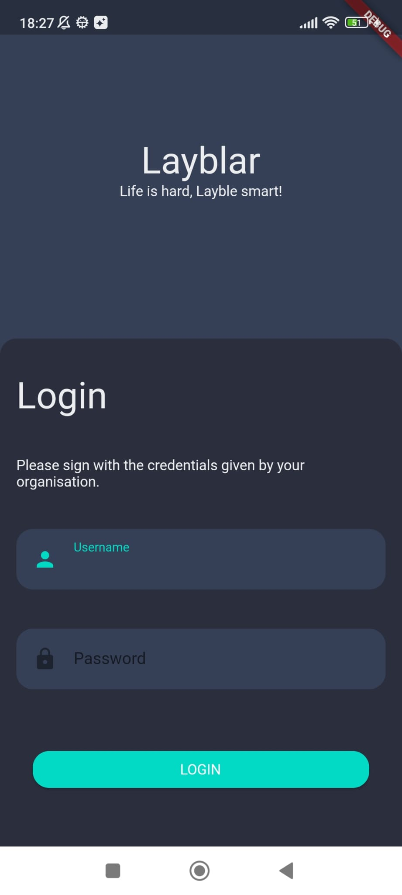

# Changelog

All notable changes to this project will be documented in this file.

## 2023-10-30 - ([Richard Lorenz](https://github.com/fluttervieh))

### Added
- First layout/structure of the Application
- implementation of the chart screen
- implementation of the stopwatch screen

## 2023-10-30 - ([Richard Lorenz](https://github.com/fluttervieh))

### Added
- Graph view: ALtrnative Inforbox when the feature time range is not enabled

## 2023-11-05 - ([Richard Lorenz](https://github.com/fluttervieh))

### Added
- Settings page to change households and logout in future
- finshed first prototype of ui for chart and timer view
- first draft for the labels screen

## 2023-11-06 - ([Richard Lorenz](https://github.com/fluttervieh))

### Added
- Plain UI for the login-screen
- Login navigation logic

